<h3> Compte Rendu AP1 Yassine Heddate G3</h3>
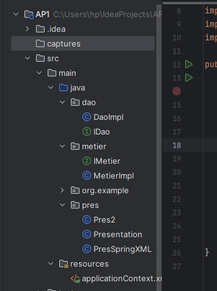
<h3> Q1:creer l interface IDAO avec une methode getDate()</h3>
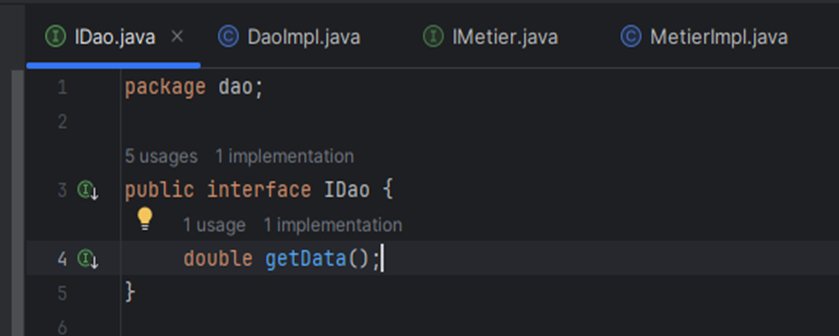
<h3> Q2:creer une implementation de cette interface</h3>
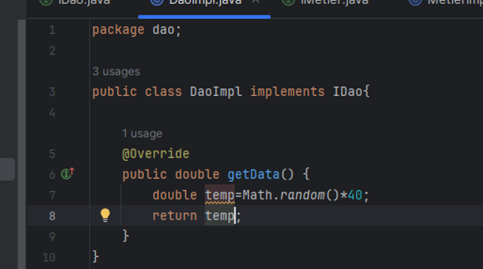
<h3> Q3:creer interface IMetier avec une methode de calcul</h3>
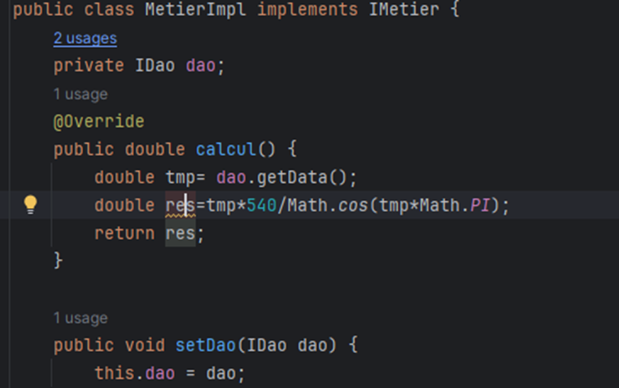
<h3> Q4:creer une implementation de cette interface couplage faible</h3>
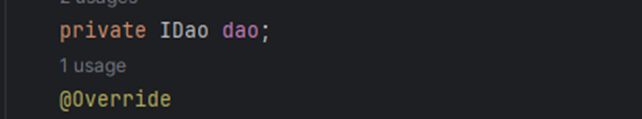
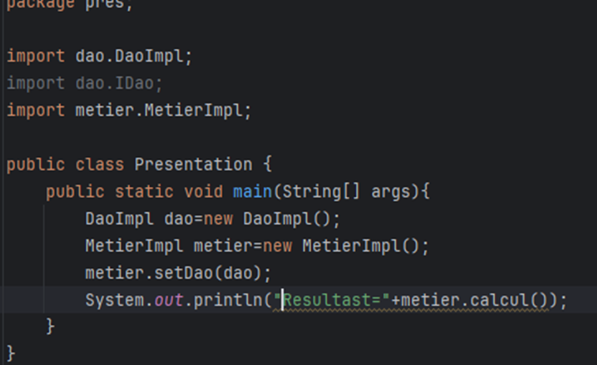
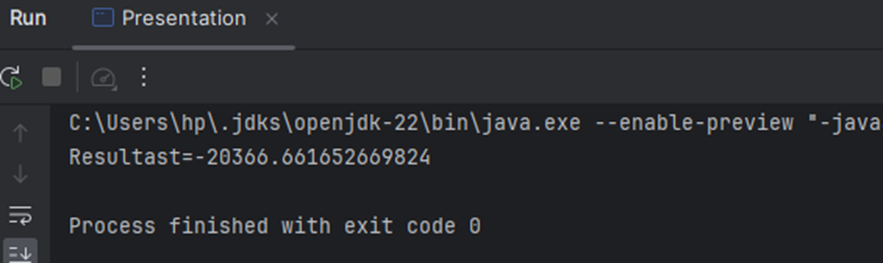
<h3> Q5:Injection depandance ins Statique</h3>
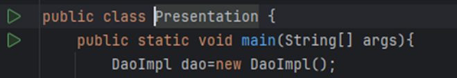
<h3> Q5:Injection depandance ins Dynamyque</h3>
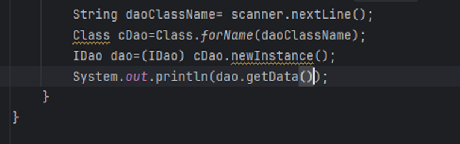
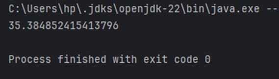
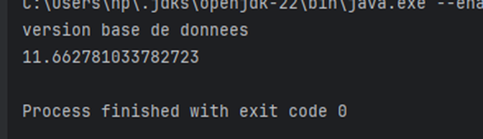
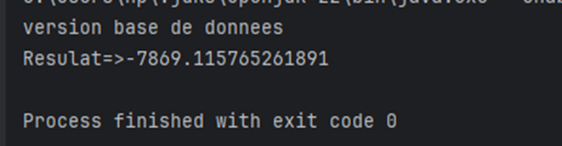

